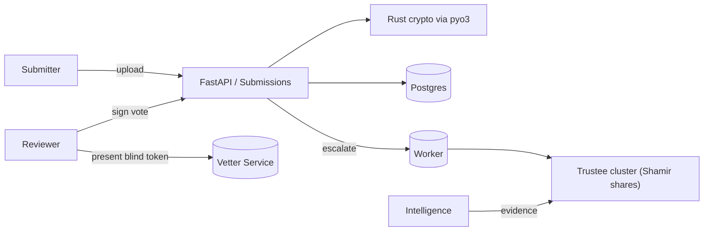

# tasklist.md — ProofPals 

> Single-source, production-ready tasklist for parallel agent execution. Divided into **Crypto**, **Full-Stack / Backend**, **Frontend**, plus **Security & DevOps** and **Final delivery**. Each task lists deliverables, step-by-step actions, common failure modes and mitigations, and a rigorous **test plan** for that area.

---

# Table of Contents

1. [Overview & conventions](#overview--conventions)
2. [Project layout & branch rules](#project-layout--branch-rules)
3. [Phase plan summary (3 phases)](#phase-plan-summary-3-phases)
4. [Crypto Team (Rust + ZK + FFI)](#crypto-team-rust--zk--ffi)
5. [Full-Stack / Backend Team (Python/FastAPI + DB + Sybil controls)](#full-stack--backend-team-pythonfastapi--db--sybil-controls)
6. [Frontend Team (React/Tailwind UI)](#frontend-team-reacttailwind-ui)
7. [Security, QA & DevOps](#security-qa--devops)
8. [Final delivery & acceptance tests](#final-delivery--acceptance-tests)
9. [Appendices: code stubs, mermaid diagrams, test matrices](#appendices-code-stubs-mermaid-diagrams-test-matrices)

---

# Overview & conventions

* Project: **ProofPals** — anonymous ring-based journalist review + sybil-resistant credential issuance + escalation pipeline.
* Default timezone: Asia/Kolkata. Target releases are incremental; follow phases.
* Use `rust` for crypto core, `pyo3 + maturin` to expose to Python. Backend in **FastAPI** (Python 3.11+), DB **Postgres**, Frontend in **React + Tailwind**.
* CI: GitHub Actions (or equivalent). All PRs require passing tests.
* Tests must be deterministic where possible; avoid network reliance except in integration/load tests.

---

# Project layout & branch rules

```
/proofpals
├─ /crypto           # Rust library + pyo3 bindings + tests + fuzz
├─ /backend          # FastAPI app, migrations, workers, tests
├─ /frontend         # React app (reviewer + submitter + admin)
├─ /zk               # ZK proof circuits and test harness (later)
├─ /ops              # Terraform/helm/k8s manifests, CI
└─ tasklist.md
```

Branch rules:

* `main` = protected (CI green, reviewed).
* Feature branches: `feat/<team>-<short-desc>`.
* Hotfix branches: `hotfix/<issue>`.
* PR template must include test run, threat impact, and "anonymity risk" statement.

Definition of DONE for each task: implementation, docs, unit tests >= 90% cover critical code paths, integration tests, security checklist, and at least one cross-team smoke test.

---

# Phase plan summary (3 phases)

* **Phase 1 — Crypto Core**: Implement Rust crypto primitives, pyo3 bindings, local tests and FFI. (Deliverable: `crypto_core` library, Python wheel)
* **Phase 2 — Backend & Rings**: FastAPI endpoints, DB, token issuance, vote engine, sybil controls, escalation pipeline. (Deliverable: backend service + DB migrations)
* **Phase 3 — Frontend, ZK polishing & Ops**: Full UI, ZK membership proofs / improvements, final audits, load & Sybil benchmarks, production deploy manifests. (Deliverable: full-stack deployable system)

---

# CRYPTO TEAM (Rust + ZK + Ring Signatures + FFI)

## Goals

* Implement secure, audited, tested cryptographic primitives:

  * Key generation from seed
  * Linkable ring signatures (LSAG/CLSAG)
  * Key-image computation (linkability)
  * Pedersen commitments primitives (for optional future use)
  * Blind-signature module (blind-RSA or blind-BLS for Phase 2 onboarding)
  * pyo3 exports ready for backend

### Deliverables

* Rust crate `proofpals-crypto` with:

  * `generate_seed()`
  * `generate_keypair(seed)`
  * `ring_sign(message, ring_pubkeys, sk)`
  * `ring_verify(message, ring_pubkeys, signature)` -> returns `(bool, key_image_bytes)`
  * `compute_key_image(sk)` (standalone)
  * `pedersen_commit(value, blinding)`, `verify_commit(commit, value, blinding)`
  * Blind-signature primitive (client & server helpers): `blind_request`, `blind_sign`, `unblind`, `verify_blind_sig`
* `pyo3` bindings and `maturin` build config
* Extensive unit/property tests and fuzz harness

---

## Tasks (ordered)

### 1. Project skeleton & dependencies

* Create crate with `cargo new proofpals-crypto --lib`.
* Add dependencies:

  * `curve25519-dalek` (ristretto)
  * `sha2` / `blake2` for hashes
  * `rand_core` / `getrandom` for CSPRNG
  * `pyo3` (with `extension-module`) and `maturin` for build
  * `proptest` for property tests
  * `cargo-fuzz` for fuzzing harness
* Add CI job to build crate, run unit tests.

**Potential errors & mitigations**

* *Error:* Linking issues with `pyo3` on CI.
  *Mitigation:* Use `maturin develop` locally; ensure CI uses Python same minor version and Rust stable. Use prebuilt wheels if necessary.
* *Error:* Insecure RNG (e.g., deterministic in some containers).
  *Mitigation:* Ensure `getrandom` works; add test that fails if RNG entropy pool returns repeated values.

**Test suite**

* Unit tests for keygen randomness (statistical basic tests), commit correctness.

---

### 2. Key generation & serialization

* Implement deterministic seed → keypair (use HKDF with seed).
* Define canonical serialization formats (compressed point bytes).
* Write compatibility tests: same seed => same keys; different seeds => different keys.

**Pitfalls**

* Big-endian/little-endian confusion when serializing scalars.
* Using point `G` incorrectly (use Ristretto API directly).

**Test suite**

* Unit tests with explicit vectors.
* Roundtrip serialize/deserialize tests (bincode/MessagePack).
* Negative tests for malformed bytes.

---

### 3. Key-image computation & linkability

* Implement `I = H_p(P) * x` (Monero-style) or equivalent agreed approach on Ristretto.
* Tests:

  * same SK -> same key-image
  * different SKs -> different key-image
  * key-image non-zero, canonical

**Pitfalls**

* Hash-to-group must use recommended APIs (ristretto compress/uncompress).
* Side-channel leakage during scalar mult; use constant-time ops.

**Test suite**

* Property tests: for many random SKs check uniqueness and equality semantics.
* Fuzz for malformed inputs.

---

### 4. Ring signature (LSAG/CLSAG)

* Implement LSAG on Ristretto (start with LSAG for speed) but write API abstract so later swap to CLSAG/Triptych.
* Signature structure includes key image.
* Implement sign/verify with message binding.
* Document math precisely in comments.

**Pitfalls & mitigations**

* *Malleability*: canonicalize challenges / ensure no alternative reprs produce valid different signatures. Enforce canonical serialization.
* *Indexing mistakes* when constructing ring permutations: unit tests that sign with index `i` and verify for ring where public keys permuted.
* *Edge-case rings*: single-member rings (should be allowed? policy decision). If allowed, ensure linkability still works.

**Test suite**

* Unit tests: sign + verify for rings sizes 1..N (N >= 50).
* Property tests: randomized rings and messages.
* Attack tests: signature forgery attempts (tamper bits).
* Fuzz the verifier with malformed signatures.

---

### 5. Pedersen commitments

* Implement `commit = g^v * h^r` (in group abstraction).
* Provide `open` and `verify_open`.
* Use for optional future membership commitments or proofs.

**Pitfalls**

* Using same `h` across contexts carefully (derive via hashed domain separation).
* Blinding factor reuse is dangerous — tests must assert uniqueness and inability to brute force.

**Test suite**

* Unit tests verifying binding and hiding properties (binding test not absolute but check for collisions with randomness used).

---

### 6. Blind-signature primitives (blind-RSA/blind-BLS)

* Implement simple blind-RSA or blind-BLS which you will use in Phase 2 for vetter -> blind token issuance.
* Provide both client & server flows; ensure unforgeability & unlinkability.

**Pitfalls**

* Wrong blinding/unblinding math leads to linkability or invalid tokens.
* RSA parameters need care (padding). BLS easier (pairings) but add dependency.

**Test suite**

* Full end-to-end issuance: client blinds → server signs → client unblinds → token verifies.
* Reuse tests and replay tests for double-issuance.

---

### 7. pyo3 bindings & maturin packaging

* Wrap core functions for Python consumption: keep thin wrappers, avoid exposing low-level pointer types.
* Produce `setup` for `maturin build` and `maturin develop`.
* Add `examples/` showing Python usage: keygen -> sign -> verify.

**Pitfalls**

* Memory safety: converting Vec<u8> <-> Python bytes must be correct.
* Cross-language panics: catch Rust panics and return Python exceptions.

**Test suite**

* Integration tests from Python: call exported functions, do full sign/verify flows.
* CI builds the wheel and runs Python tests in a matrix (Linux, MacOS if possible).

---

### 8. Fuzzing & property tests

* Add `cargo-fuzz` targets to fuzz verify and deserialize code paths.
* Add property-based tests for sign/verify invariants with `proptest`.

**Pitfalls**

* Fuzz harness must avoid allocating massive memory; set limits.
* Handle panics gracefully.

**Test suite**

* Fuzz in CI nightly; property tests run on PR.

---

## Crypto DONE criteria

* All functions implemented, exported to Python, and documented.
* Unit tests + property tests + fuzz harness pass locally and in CI.
* Benchmark tests: sign/verify at 1000 ops/sec for ring size 32 on target hardware (record numbers).
* Security checklist reviewed.

---

# FULL-STACK / BACKEND TEAM (FastAPI + DB + Sybil Controls + Workflow Engine)

## Goals

* Build robust backend services to manage rings, submissions, votes, token issuance (blind credential presentation), and escalation pipeline.
* Provide atomicity on vote consumption and vote tallying to avoid double-spend or race conditions.

### Deliverables

* FastAPI app with documented routes (OpenAPI)
* DB (Postgres) schema + migrations
* Celery / RQ worker for escalation and long-running tasks
* Redis for rate limiting / token redemption atomicity
* Integration test harness (docker-compose)
* Load & Sybil stress test scripts

---

## Tasks (ordered)

### 1. Schema design & migrations

Create SQL migrations (e.g., with Alembic). Tables:

* `submissions` (`id`, `genre`, `content_ref`, `submitter_ip_hash`, `submitter_mac_hash`, `created_at`, `status`, `last_tallied_at`)
* `rings` (`id`, `genre`, `pubkeys` JSONB, `epoch`, `created_at`, `active`)
* `reviewers` (`id`, `profile_hash`(optional), `credential_meta`(encrypted), `created_at`, `revoked_bool`)
* `votes` (`id`, `submission_id`, `ring_id`, `signature_blob`, `key_image`, `vote_type`, `token_id`, `verified_bool`, `created_at`)
* `tokens` (`token_id`, `cred_id_hash`, `epoch`, `redeemed_bool`, `redeemed_at`)
* `escalations` (`id`, `submission_id`, `reason`, `evidence_blob`, `status`, `requested_at`)
* `audit_logs` append-only

**Pitfalls**

* JSONB pubkeys too large? Use `bytea` arrays for efficiency.
* Race on `tokens` redeem: must be atomic — use DB transaction or Redis atomic ops.

**Test suite**

* DB migration apply/rollback tests
* Schema validation + example fixtures tests

---

### 2. API design (routes)

Key endpoints:

* `POST /submissions` — submit content
* `GET /submissions/{id}` — view meta/status
* `POST /rings` — create ring (admin)
* `GET /rings/{id}/pubkeys` — list PKs (only for server internal)
* `POST /present-credential` — present blind token, request epoch tokens
* `POST /vote` — submit signature_blob + token_id
* `GET /tally/{submission_id}` — get tally result (admin)
* `POST /revoke-credential` — vetter only
* `POST /escalations/{id}/resolve` — admin

**Pitfalls**

* Input validation errors exposing internal errors — sanitize responses.
* Large signature blobs: limit size; stream if necessary.

**Test suite**

* OpenAPI contract tests
* Negative tests with malformed inputs
* Authentication & authz tests for protected endpoints

---

### 3. Vote ingestion & verification pipeline

Flow for `POST /vote`:

1. Accept: `submission_id`, `ring_id`, `signature_blob`, `proof_of_token` (or `token_id`)
2. Atomically:

   * Verify token: `verify_and_consume_token(token_id)` — atomic DB update or Redis Lua script
   * Call into Rust FFI: `verify_ring(message, ring_pubkeys, signature_blob)` → returns `(ok, key_image)`
   * Check `votes` table for `submission_id` + `key_image` to prevent double-vote
   * Insert vote record
   * Optionally trigger tally if vote_count >= threshold or periodic worker will run tally

**Pitfalls**

* Race condition: two concurrent requests both see token unused and both consume — use DB transaction with `SELECT FOR UPDATE` or Redis atomic consume.
* Slow FFI: add timeouts and circuit-breaker.
* Signature verification fails due to different canonicalization: ensure canonical message formation.

**Test suite**

* Concurrency tests: simulate N concurrent `POST /vote` with same token → assert only one accepted.
* Integration tests: full flow from token issuance -> vote consumption -> tally.

---

### 4. Tally engine & decision logic

* Implement deterministic tally routine:

  1. Aggregate unique `key_image` votes for the submission (only verified votes).
  2. Count `count_pk`, `count_sk`, `count_reject`, `count_flag`.
  3. Apply rules:

     * If `count_flag >= urgent_flag_limit` → escalate immediately
     * If `count_pk + count_sk > count_reject` → APPROVE
     * Else → REJECT
     * Ties → human review (escalation)
* Make thresholds configurable per ring/genre.

**Pitfalls**

* Counting duplicates: ensure `key_image` uniqueness ensures per-credential one vote; key images presented in different rings might collide (rare if design consistent) — include ring_id as part of canonical message when computing key images to scope to ring/epoch if required.
* Time-windowing: votes across epochs should not mix.

**Test suite**

* Unit tests for multiple scenarios (ties, flag thresholds, 1-off cases).
* Monte Carlo tests simulating random votes and attacker influence.

---

### 5. Token issuance & revocation (blind tokens)

* Implement vetter service workflow:

  * Endpoint for blinded requests: `POST /vetter/blind-sign` (restricted)
  * Client flow: get blind signed token -> unblind -> store locally
* Implement `POST /present-credential` where a user proves possession of valid blind-signed token (or sends serial) and server mints `N` epoch tokens (one-time coupons).
* Store `revocation` list; revocation checks at `present-credential` and `vote` time.

**Pitfalls**

* Blind token reuse / replay. Use serials or single-use counters.
* Revocation leaks: if token serials are published, can deanonymize; consider accumulator-based revocation later.

**Test suite**

* End-to-end blind issuance tests (sign/unblind/verify)
* Token redemption tests with edge cases (expired token, revoked token)
* Revocation test scaffold: revoke -> try present -> expect refusal

---

### 6. Escalation pipeline

* Implement worker/queue which:

  * Packages evidence: content hash, content snapshot, submitter metadata (IP/MAC hash), ring_id, vote counts, classifier result
  * Encrypts evidence for intelligence/trustees
  * Logs audit entry
  * Notifies human reviewers
* Implement policies:

  * `urgent_flag_limit`, `flag_fraction` config
  * Emergency council path requiring `t` trustees to reconstruct mapping (Shamir share) — the `ops` team manages trustees.

**Pitfalls**

* Over-automation causing false-positives. Ensure human confirmation before unmasking.
* Evidence leaks: use proper encryption and access controls.

**Test suite**

* Escalation dry-run tests: check encryption, package format, audit logs exist.
* Simulated legal request flow test with dummy trustees.

---

### 7. Monitoring, rate-limiting, anomaly detection

* Implement:

  * Per-token rate limits with Redis
  * Per-IP request rate limits for submission endpoints
  * Anomaly detection worker for sudden flag bursts
* Add alerting rules.

**Pitfalls**

* Overly strict rate limit blocks genuine activity; keep monitor logs for tuning.
* Rate-limit bypass via rotating proxies—tie to credential tokens, not just IP.

**Test suite**

* Rate-limit unit tests
* Simulated attacks (rapid requests, rotating IPs) in staging load tests.

---

### 8. CI & integration tests

* Build service + run unit tests
* Bring up dependency stack in `docker-compose` (Postgres, Redis) and run integration tests
* Include tests that call into the Rust wheel to verify full path.

**Pitfalls**

* Tests depending on external services failing; mock services or use stable images.
* Non-deterministic tests (race conditions) — reproducible seeds needed.

**Test suite**

* `pytest` based integration test suite that runs in CI.
* Add `tox` envs for Python versions matrix.

---

## Backend DONE criteria

* All APIs implemented with docs.
* DB migrations applied and tested.
* Token issuance + redemption + vote ingestion working end-to-end.
* Concurrency/double-spend protection proven by tests.
* Tally engine validated with unit & Monte Carlo tests.
* Sybil attack simulations produce metrics recorded (see Sybil benchmark scripts).
* CI green on PRs.

---

# FRONTEND TEAM (React + Tailwind + Reviewer UX)

## Goals

* Build clean, minimal UIs: Submitter, Reviewer, Admin/Escalation dashboards.
* Ensure UIs never leak identity or ring membership data.
* Provide usability for reviewers to vote with minimal friction.

### Deliverables

* `frontend/` React app with:

  * Submitter page (upload + status)
  * Reviewer vote screen (one submission at a time, blinded)
  * Admin/Escalation dashboard (for human reviewers & trustees)
  * Integration tests (Cypress)
  * Accessibility & privacy checks

---

## Tasks (ordered)

### 1. Design system & components

* Use Tailwind, components: `UploadCard`, `SubmissionCard`, `VoteButtons`, `AnonConfirmationModal`, `EscalationModal`, `Notifications`.
* Use local secure storage for any client-side secrets (IndexedDB + encryption).

**Pitfalls**

* Browser storage leaks private seed — never store unencrypted seed on browser persistent storage unless user consents; prefer ephemeral storage and encourage hardware-backed keys (optional).

**Test suite**

* Unit tests for components (Jest + React Testing Library).
* Security checklist: ensure no sensitive data in `console.log`.

---

### 2. Submitter UI

* Upload flow:

  * file upload (PDF / EPUB), meta: title, genre
  * preview step
  * consent checkbox for IP+MAC storage
  * submit and show status
* Polling/websocket to show status changes (pending -> approved/rejected/flagged)

**Pitfalls**

* Large file uploads — implement chunk uploads or S3 presigned flow.
* Reveal of metadata — never show reviewer count per ring or reviewer identities.

**Test suite**

* E2E upload tests (Cypress) with mock backend
* File size / invalid file tests
* UI responsiveness tests

---

### 3. Reviewer UI (anonymous voting flow)

* Reviewer logs in with their client-side seed (preferably hardware or passphrase).

* Workflow:

  1. Fetch next submission: `GET /review/next?ring_id=...`
  2. Show content only (no submitter PII)
  3. Provide three big buttons: `PK Approve`, `SK Escalate`, `Reject`, `Flag`
  4. Confirm modal asks: "This vote is signed and anonymous. Proceed?"
  5. On confirm: client builds canonical message + ring signature via Rust wheel (via local pyo3 or webassembly? See note)
  6. If offline signing used (native), send signature_blob + token proof to backend.

* Note on client crypto runtime:

  * Option A: Run signing locally in Rust via a CLI desktop app (Electron with native extension or Python-backed local helper).
  * Option B: Use WASM build of Rust crypto for browser signing (careful with entropy & side-channel).
  * Choose per target audience. Start with a desktop CLI + web UI integration for Phase 1; later add WASM.

**Pitfalls**

* Browser-based cryptography can be risky: lack of secure RNG, side-channel leaks, key persistence.
* If you choose WASM, ensure proper seeding and use `window.crypto` for randomness and SRP for key derivation if needed.

**Test suite**

* Unit test: button flow, state transitions.
* E2E test: simulate signing and backend acceptance.
* Security check: verify no secret stored in logs, and app clears sensitive values on logout.

---

### 4. Admin/Escalation UI

* Allow authorized human reviewers to:

  * View escalation evidence package
  * Mark escalate/resolve
  * Request trustee unmask (start share reveal process)
* Show audit logs (redacted) and transparency reports.

**Pitfalls**

* Mistakenly exposing full evidence to unauthorized users — enforce RBAC and audit every view.
* Exposing token serials — redact.

**Test suite**

* RBAC tests (role-based access via mocked tokens)
* Escalation flow tests (simulate unlocking evidence)

---

### 5. UX & Privacy checks

* Ensure all pages do not show exact volunteer counts or PK lists.
* Use privacy-friendly analytics or none.
* Implement Content Security Policy.

**Test suite**

* Automated checks for CSP headers in responses (E2E).
* Accessibility tests (axe).

---

## Frontend DONE criteria

* React app implemented, E2E tests pass in CI, no client-side logs of private values, sign flow works with backend in staging, and user docs for reviewer key management exist.

---

# SECURITY, QA & DEVOPS

## Goals

* Safe key handling, secrets, CI security, key rotation, incident response.
* Automated benchmarking for sybil resistance & load.

### Tasks

### 1. Key management & trustee shares

* Use **HSM** or cloud KMS (AWS KMS / GCP KMS) to encrypt PK→identity mapping if stored.
* Implement Shamir secret-sharing for decryption key `K`:

  * `ops` generates `K`, encrypts mapping file with `K`, splits `K` into `n` shares, distributes to trustees.
  * Implement trustee approval web UI to collect shares (manual in Phase 1).
* Document legal SOP for unmasking.

**Pitfalls**

* Trustee compromise — choose diverse trustees, use tandems.

**Test suite**

* Unit test Shamir share creation & reconstruction
* Simulated attorney request flow in staging

---

### 2. CI/CD & secrets

* CI pipeline:

  * Lint, unit tests, Rust build, Python wheel build, Docker image build, E2E tests, security static analysis
* Secrets:

  * Use vault or CI secrets; never store private keys in repo.

**Pitfalls**

* Secrets leakage in logs — sanitize.
* Build artifacts carrying secrets — reproduce builds from scratch.

**Test suite**

* CI smoke tests, secret-scan with `truffleHog` or similar

---

### 3. Monitoring & logs

* Centralized logging (ELK/Datadog) with PII redaction layer.
* Alerts for:

  * Frequent flag events
  * Token redemption anomalies
  * Large numbers of revocations

**Pitfalls**

* Logs may include signature blobs or key material accidentally. Implement log scrubbing.

**Test suite**

* Automated log sanity tests ensuring no regex matches for private fields.

---

### 4. Sybil benchmark harness (must be automated)

* Provide scripts to simulate attacker behaviors:

  * Bulk blind-token creation simulation (mock vetter to see raw cost)
  * Mass vote flows with rotating IPs
  * Monte Carlo simulation computing `P(attacker wins)` for various `k/R`
* Use `locust` or `k6` for load testing of backend endpoints.

**Pitfalls**

* Creating too realistic attacker simulation may require real KYC — mock vetter is recommended.

**Test suite**

* Benchmark automation that produces JSON report, CSV, and graph. CI can run weekly.

---

# Final delivery & acceptance tests

## Acceptance test suite (must pass before release)

1. **Functional smoke test**

   * Submit 10 submissions across 3 genres
   * Create 5 rings (size 5)
   * Issue blind tokens to 50 reviewers (simulate)
   * Each reviewer casts votes; no duplicate votes accepted
   * Final tally matches expected decisions

2. **Concurrency / Race test**

   * Simulate 500 concurrent `POST /vote` requests for single submission with valid tokens; ensure no double consumption and correct final tally.

3. **Sybil stress test**

   * Simulate attacker creating 100 fake credentials (mocked vetter) and attempt to influence ring of 5; collect metrics `P(attacker_wins)`.

4. **Escalation test**

   * Trigger `flag` path and ensure evidence package generated, encrypted, audit logged and notification created.

5. **Security audit checklist**

   * No secret in repos
   * No private keys in logs
   * Minimal PII retention verified
   * Trustee unmask flow tested (no single admin unmask)

6. **Performance baseline**

   * Record sign/verify latency at ring sizes [5, 16, 32, 64]
   * Backend should sustain X requests/sec (specify target hardware)

---

# Appendices: code stubs, mermaid diagrams, test matrices

## Example Rust function signature (pyo3 export)

```rust
#[pyfunction]
fn generate_keypair(seed: Vec<u8>) -> PyResult<(Vec<u8>, Vec<u8>)> {
    // returns (sk_bytes, pk_bytes)
}

#[pyfunction]
fn ring_sign(message: Vec<u8>, ring_pks: Vec<Vec<u8>>, sk: Vec<u8>, idx: usize) -> PyResult<Vec<u8>> {
    // returns signature blob containing key_image
}

#[pyfunction]
fn ring_verify(message: Vec<u8>, ring_pks: Vec<Vec<u8>>, signature: Vec<u8>) -> PyResult<(bool, Vec<u8>)> {
    // returns (ok, key_image_bytes)
}
```

## Example Python backend snippet (vote ingestion atomic)

```python
# Pseudocode - FastAPI endpoint
@router.post("/vote")
async def submit_vote(payload: VotePayload, db: Session = Depends(get_db)):
    # 1. verify and atomically consume token
    token_ok = await token_service.verify_and_consume(payload.token_id)
    if not token_ok:
        raise HTTPException(400, "Invalid/Consumed token")

    # 2. verify signature via rust binding
    ok, key_image = crypto.ring_verify(payload.message, ring_pubkeys, payload.signature)
    if not ok:
        raise HTTPException(400, "Invalid signature")

    # 3. check duplicate
    with db.begin():
        exists = db.query(Vote).filter_by(submission_id=payload.submission_id, key_image=key_image).first()
        if exists:
            raise HTTPException(409, "Duplicate vote")
        # store vote...
```

## Mermaid architecture (render where supported)



## Test matrix (brief)

| Area         |   Unit tests |    Integration tests |     E2E / Load | Fuzz |
| ------------ | -----------: | -------------------: | -------------: | ---: |
| Crypto       |           ✔️ | ✔️ (python bindings) |             ✖️ |   ✔️ |
| Backend      |           ✔️ |  ✔️ (docker-compose) | ✔️ (k6/locust) |   ✖️ |
| Frontend     |           ✔️ |         ✔️ (cypress) |  ✔️ (selenium) |   ✖️ |
| Ops/Security | ✔️ (scripts) |     ✔️ (deploy test) | ✔️ (benchmark) |   ✖️ |

---

# Final notes & operational checklist for agents

* **Do not store mapping `pk -> real identity` in plaintext** anywhere in the repo. If mapping needed, encrypt and split-key-share.
* **All changes must include tests**. No PR merged without tests and at least one cross-team smoke test.
* **Document all threat assumptions** in `security/threat-model.md`.
* **Record benchmark numbers** in `benchmarks/` with environment details.

---

